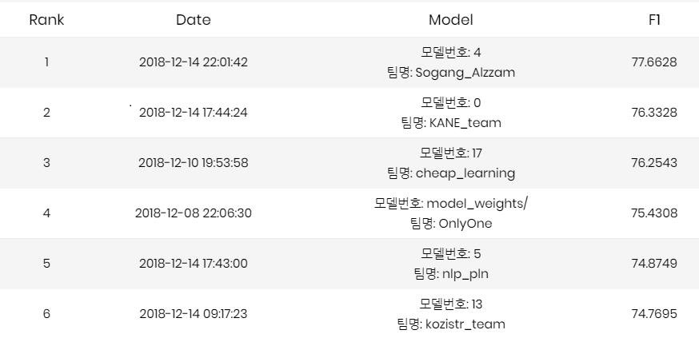

# [NAVER NLP Challenge 2018](https://github.com/naver/nlp-challenge)

### **Team kozistr_team - Member : 김형찬(kozistr)**

---

## tl;dr

I participated in [NAVER NLP Challenge 2018] and 
**ranked 6th** as an individual participant (Team : kozistr_team)

And also i uploaded **the codes** and will also upload **presentation** file.

### Final LeaderBoard

> SRL (Semantic Role Labeling)

### Result

| *Mission* | *Metric* | *Score* | *Rank* | *Code*
| :-------: | :------: | :-----: | :----: | :------:
|    SRL    |    F1    | 74.7695 |   6th  | [code](./missions/srl/model.py)

## Models

Soon~

## Summary

Soon~

## Hyper-Parameters

### SRL

|           Name            |     Value      |          Note                 |
| :-----------------------: | :------------: | :---------------------------: |
|          Epochs           |      20        | 15 ~ 20 에서 converge         |
|            LR             |      1e-3      |                               |
|      LR decay factor      |      0.9       | by 1 epoch (exp decay)        |
|     gradient clipping     |      5.0       |                               |
|        Batch Size         |      20        | 더도 덜도 말고 20              |
|       DropOut Rate        |      0.5       | 0.5 is the best               |
|        Embeddings         |      256       | 256 good                      |
|      LSTM unit size       |      256       | grid search [128, 256, 300]   |
|        Optimizer          |      Adam      |                               |
